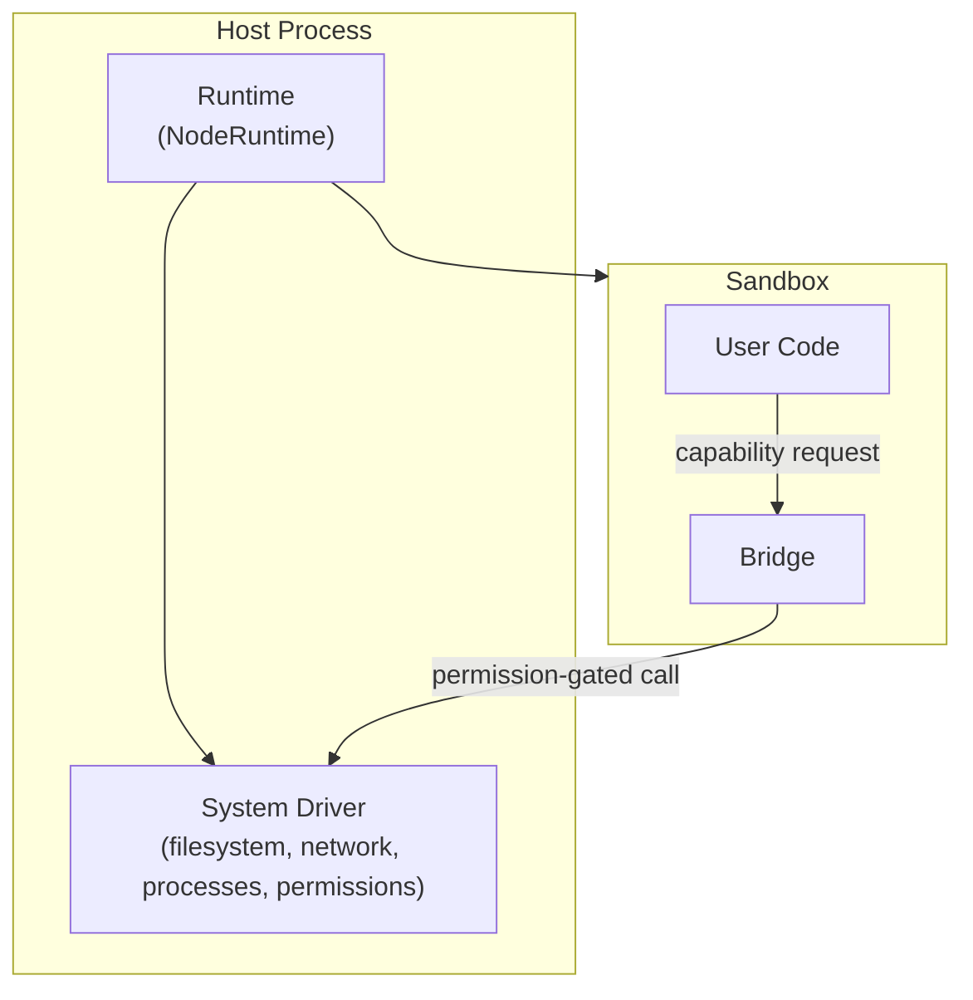
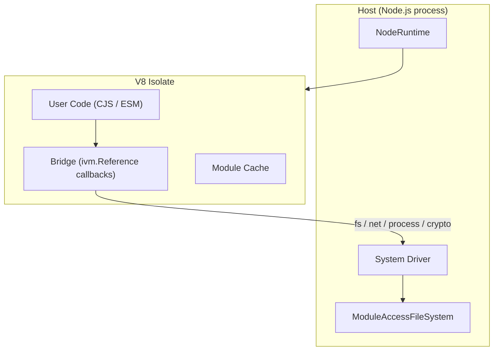
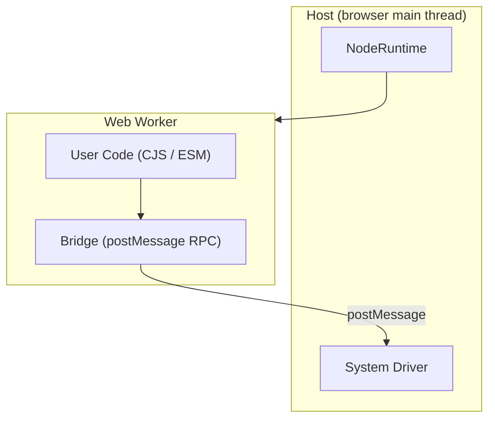

## Overview

Every secure-exec sandbox has three layers: a **runtime** (public API), a **bridge** (isolation boundary), and a **system driver** (host capabilities).



User code runs inside the sandbox and can only reach host capabilities through the bridge. The bridge enforces payload size limits on every transfer. The system driver wraps each capability in a permission check before executing it on the host.

## Components

### Runtime

The public API. `NodeRuntime` is a thin facade that accepts a system driver and a runtime driver factory, then delegates all execution to the isolate.

```ts
import {
  NodeRuntime,
  createNodeDriver,
  createNodeRuntimeDriverFactory,
} from "secure-exec";

const runtime = new NodeRuntime({
  systemDriver: createNodeDriver(),
  runtimeDriverFactory: createNodeRuntimeDriverFactory(),
});

await runtime.exec("console.log('hello')");
await runtime.run("export default 42");
runtime.dispose();
```

### System Driver

A config object that bundles host capabilities. Deny-by-default.

| Capability | What it provides |
|---|---|
| `filesystem` | Read/write/stat/mkdir operations |
| `network` | fetch, DNS, HTTP |
| `commandExecutor` | Child process spawning |
| `permissions` | Per-capability allow/deny checks |

Each capability is wrapped in a permission layer before the bridge can call it. Missing capabilities get deny-all stubs.

### Bridge

The narrow interface between the sandbox and the host. All privileged operations pass through the bridge. It serializes requests, enforces payload size limits, and routes calls to the appropriate system driver capability.

## Node Runtime

On Node, the sandbox is a V8 isolate managed by `isolated-vm`.



**Inside the isolate:**
- User code runs as CJS or ESM (auto-detected from `package.json` `type` field)
- Bridge globals are injected as `ivm.Reference` callbacks for fs, network, child_process, crypto, and timers
- Compiled modules are cached per isolate
- `Date.now()` and `performance.now()` return frozen values by default (timing mitigation)
- `SharedArrayBuffer` is unavailable in freeze mode

**Outside the isolate (host):**
- The V8 isolate execution environment creates contexts, compiles modules, and manages the isolate lifecycle
- `ModuleAccessFileSystem` overlays host `node_modules` at `/app/node_modules` (read-only, blocks `.node` native addons, prevents symlink escapes)
- System driver applies permission checks before every host operation
- Bridge enforces payload size limits on all transfers (`ERR_SANDBOX_PAYLOAD_TOO_LARGE`)

**Resource controls:**
- `memoryLimit`: V8 isolate memory cap (default 128 MB)
- `cpuTimeLimitMs`: CPU time budget (exit code 124 on exceeded)
- `timingMitigation`: `"freeze"` (default) or `"off"`

## Browser Runtime

In the browser, the sandbox is a Web Worker.



**Inside the worker:**
- User code runs as transformed CJS/ESM
- Bridge globals are initialized from the worker init payload
- Filesystem and network use permission-aware adapters
- DNS operations return deterministic `ENOSYS` errors

**Outside the worker (host):**
- The browser isolate spawns workers, dispatches requests by ID, and correlates responses
- `createBrowserDriver()` configures OPFS or in-memory filesystem and fetch-based networking
- Node-only runtime options (like `memoryLimit`) are validated and rejected at creation time

## Permission Flow

Every capability request follows the same path regardless of runtime:

```
User Code -> Bridge -> Permission Check -> System Driver -> Host OS
```

If the permission check denies the request, the bridge returns an error before the system driver is called. If no adapter is configured for a capability, a deny-all stub handles it.
