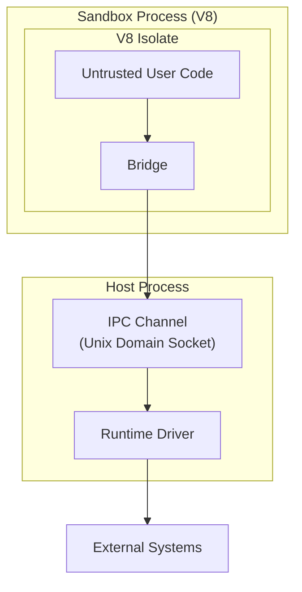

`secure-exec` runs untrusted code in a **separate V8 process** — the same defense-in-depth approach used by **modern browsers** (site isolation) and **Cloudflare Workers**. Host access is blocked by default and only available through explicitly configured capabilities.

## Runtime Guarantees

When you run untrusted code through `secure-exec`, the runtime enforces:

- **Process isolation**: code runs in a dedicated child process with its own memory space, file descriptor table, and signal handlers. A crash in the sandbox cannot bring down the host.
- **Capability gating**: filesystem, network, process spawn, and environment access are all blocked unless you explicitly allow them.
- **Timing hardening**: high-resolution timers are frozen by default to mitigate timing side channels.
- **Resource limits**: CPU time and memory are bounded so user code can't run forever or exhaust the host.

## Trust Boundaries

There are three boundaries you need to think about:

### Process Boundary

The V8 runtime runs in a **separate OS process**. This is the primary security boundary — the OS kernel enforces memory isolation, FD table separation, and signal isolation between the sandbox and host processes.

### Runtime Boundary

The isolate + bridge inside the sandbox process. Untrusted code is confined to a V8 isolate and can only reach host capabilities through bridge functions that serialize requests over IPC. The bridge enforces capability gating on every call.

### Host Boundary

Your process, container, or serverless runtime. The host process itself is trusted infrastructure. You're responsible for hardening it. For internet-facing workloads with untrusted input, deploy in an already-hardened environment like AWS Lambda, Google Cloud Run, or a similar sandboxed platform.

All three boundaries matter. Process isolation protects the host from sandbox crashes, the bridge restricts what sandbox code can request, and a hardened host protects against threats outside the sandbox model.

## Process Isolation

The sandbox V8 engine runs in a dedicated child process with its own OS-level resources. This provides stronger isolation than in-process isolates:

### What process isolation protects against

- **V8 OOM** — if sandbox code exhausts the heap, the child process crashes. The host process remains alive and surfaces the error to the caller.
- **Heap corruption** — a V8 engine bug that writes out of bounds corrupts the child process memory, not the host. In-process isolates share the same address space.
- **File descriptor leakage** — the sandbox process has its own FD table. Sandbox code cannot access host FDs (database connections, credential files, other sockets) even through a V8 engine bug.
- **Signal interference** — signals delivered to the sandbox process don't affect the host. `SIGSEGV` from V8 WASM trap handling stays in the child.
- **Uncontrolled resource consumption** — the sandbox process can be placed under OS-level resource controls (cgroups for memory/CPU, seccomp filters, namespaces) that are impossible for in-process isolates.
- **Clean termination** — a hung or misbehaving isolate can be terminated via `SIGKILL`, which the OS guarantees will succeed. In-process `terminate_execution()` is cooperative and can be defeated by native code bugs.

### What process isolation does NOT protect against

- **IPC-level attacks** — the communication channel between host and sandbox is a new attack surface that doesn't exist in in-process models. See [IPC Channel](#ipc-channel) below for mitigations.
- **Host-side vulnerabilities** — process isolation protects the host from sandbox crashes, but the host boundary is still your responsibility. A vulnerability in your host code that processes sandbox output could still be exploited.
- **Authorized capability abuse** — if you grant filesystem or network permissions, sandbox code can use them. Process isolation doesn't restrict what capabilities you choose to expose.
- **Side channels** — timing side channels and other covert channels may still be possible across process boundaries. See [Timing Hardening](#timing-hardening) for mitigations.

## IPC Channel

The host and sandbox processes communicate over a **Unix domain socket** using length-prefixed binary framing. The channel is a trust boundary with the following properties:

### Authenticated

The host generates a one-time 128-bit token and passes it to the sandbox process via environment variable. The first message on any connection must present this token. Connections that fail authentication are closed immediately.

### Session-bound

Sessions are identified by 128-bit nonces and bound to the connection that created them. A connection can only interact with its own sessions — cross-session access from another connection is rejected.

### Size-limited

Messages exceeding **64 MB** are rejected at the framing layer. Any framing or deserialization error closes the connection immediately (no skip-and-continue). This prevents memory exhaustion from malformed or oversized messages.

### Not encrypted

The IPC channel does **not** use encryption. This is intentional — both processes run on the same host, and the socket is created in a `mkdtemp` directory with `0700` permissions. Same-host UDS traffic never touches the network and is protected by filesystem permissions.

### FD hygiene

The sandbox process closes all inherited file descriptors (except stdin/stdout/stderr and the IPC socket) on startup and sets `CLOEXEC` on all new FDs. This prevents FD leakage from the host into the sandbox.

## Module Loading Boundary

When configured, Node runtime executions expose a read-only dependency overlay at `/root/node_modules` sourced from `<cwd>/node_modules`, where `<cwd>` is the host directory set via `moduleAccess.cwd`. The overlay is only mounted when that directory exists.

- Overlay reads are constrained to canonical paths under `<cwd>/node_modules`.
- Overlay paths under `/root/node_modules` are read-only runtime state.
- Native addons (`.node`) are rejected in this mode.
- Access outside overlay paths remains permission-gated and deny-by-default.

This preserves a narrow runtime boundary for dependency loading while still allowing controlled reuse of host-installed `node_modules`.

## Timing Hardening

By default, high-resolution timers are frozen to make timing side-channel attacks harder. You can turn this off if you need Node-compatible advancing clocks.

In default `"freeze"` mode (`timingMitigation: "freeze"`):

- `Date.now()` and `performance.now()` return frozen values within an execution.
- `process.hrtime()`, `process.hrtime.bigint()`, and `process.uptime()` follow the hardened path.
- `SharedArrayBuffer` is unavailable. Shared memory between threads can be used to [build high-resolution timers](https://v8.dev/blog/spectre) that [bypass frozen clocks](https://security.googleblog.com/2021/03/a-spectre-proof-of-concept-for-spectre.html).

Setting `timingMitigation: "off"` gives you normal advancing clocks but weaker side-channel protection.

## Resource Limits

Two controls prevent runaway execution:

- **`cpuTimeLimitMs`**: execution time budget for the runtime. When exceeded, V8 execution is terminated and the result reports `errorMessage` `Script execution timed out` with error code `ERR_SCRIPT_EXECUTION_TIMEOUT`.
- **`memoryLimit`**: Isolate memory cap in MB (default `128`).

The bridge also enforces isolate-boundary payload limits so oversized base64 file transfers and oversized isolate-originated JSON payloads are rejected deterministically with `ERR_SANDBOX_PAYLOAD_TOO_LARGE` instead of exhausting host memory. Hosts can tune these limits within bounded safe ranges, but cannot disable enforcement.

## Logging Contract

- Console output is **not buffered** into runtime-managed execution result fields by default (`exec()`/`run()` do not expose `stdout`/`stderr` result fields).
- To consume logs, configure the optional `onStdio` streaming hook and forward events to your own sink.
- This avoids implicit host-memory growth from untrusted high-volume logging.
